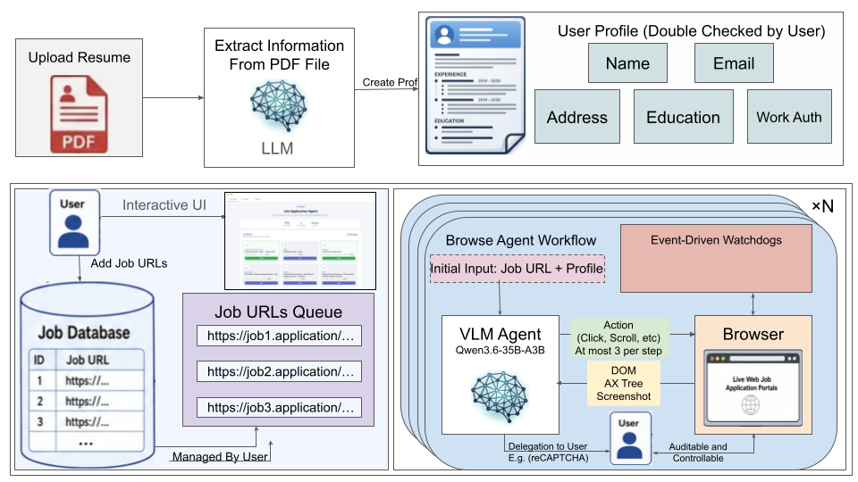

# Dawn — Autonomous Job-Application Agent

Dawn is an end-to-end agent that auto-fills and submits online job applications. You drop in a resume, paste a queue of job URLs, and a vision-enabled LLM agent drives a real Chromium browser to complete each application — pausing for you only when it hits a CAPTCHA, login, or 2FA prompt.

It combines an Electron desktop app (the browser surface + UI), a FastAPI Python backend (orchestration + scraping), and the [`browser-use`](https://github.com/browser-use/browser-use) agent (perception + action loop) talking to an OpenAI-compatible LLM.

---

## Demo

https://github.com/user-attachments/assets/762ceae8-f7fa-4ee8-a976-f984c9509f5e


---

## Architecture



---

## Pipeline (end-to-end)

1. **Resume parsing.** PDF is base64-encoded in the renderer and POSTed to `/parse-resume`. The backend calls **OpenAI GPT-4o-mini (vision)** to extract `name`, `email`, `phone`, `linkedin`, `location`, etc.
2. **Profile + queue.** User edits profile fields and pastes up to 10 job URLs. State is cached in `localStorage`.
3. **Start.** Renderer sends `start_applications {urls, profile}` over WebSocket (`ws://localhost:8765/ws`).
4. **Per-URL session.** Backend creates a session per URL; Electron loads each URL into a separate `<webview>`; on `dom-ready` the backend's `BrowserSession` connects to that webview's CDP target on port `9222` (with retries for redirects).
5. **Agent loop.** A `browser-use` Agent runs (≤ 50 steps, ≤ 3 actions/step). Each step it sends DOM + screenshot + accessibility tree to the OpenAI LLM and executes the returned actions (click / type / select / file-upload).
6. **Human-in-the-loop.** On CAPTCHA / login / 2FA / email-verification the agent calls `request_human_intervention(reason)`. The backend emits `session_needs_review`; the UI shows a yellow "Review" tab with a Resume button. Clicking Resume sends `resume_session`, which `set()`s an `asyncio.Event` and the agent continues.
7. **Completion.** `session_done {success, message}` closes the session; logs remain visible in the tab.
8. **Job board (parallel side-flow).** `/fetch-jobs` scrapes markdown tables from a GitHub SWE-Jobs README, upserts rows into `jobs.db` (SQLite, WAL), and `/jobs` serves them to the UI with search/category filters.

---

## Quick Start

### Prerequisites
- **macOS / Linux** (tested on macOS 14+)
- **Node.js ≥ 18** and **npm**
- **Python ≥ 3.11**
- An **OpenAI API key**

### 1. Clone
```bash
git clone <your-fork-or-repo-url> dawn
cd dawn
```

### 2. Install `browser-use` (vendored) and Python deps
```bash
cd browser-use
python3 -m venv .venv
source .venv/bin/activate
pip install -e .
cd ..
pip install -r backend/requirements.txt
```

### 3. Install Electron deps
```bash
npm install
```

### 4. Configure `.env`
Create `dawn/.env` in the project root:

```ini
# Required — OpenAI API key (used by both resume parser and browser-use agent)
openai-api-key=sk-...

# Optional — browser-use cloud key (only if you opt into hosted features)
# browser-use-api-key=

# LLM model for the browser agent (default: gpt-4.1-mini)
LLM_MODEL=gpt-4.1-mini

# Optional — point at an OpenAI-compatible endpoint (Azure, vLLM, etc.)
# LLM_BASE_URL=https://api.openai.com/v1

# Enable vision (DOM + screenshot). Set to "false" for DOM-only, faster/cheaper.
LLM_USE_VISION=true

# Optional event timeouts (seconds) for slow pages
TIMEOUT_ScreenshotEvent=30
TIMEOUT_BrowserStateRequestEvent=30
```

> `main.js` reads this `.env` and forwards `openai-api-key` → `OPENAI_API_KEY` for the Python backend.

### 5. Run
```bash
./start.sh
```

`start.sh` will: pick the venv Python if present, install missing FastAPI deps, free port `9222` if held, then `npm start` (Electron). The backend is launched as a child process by `main.js` on startup.

### 6. Use
1. Drag a resume PDF onto the upload zone → profile auto-fills.
2. Edit any fields (location, visa, summary, …).
3. Paste up to 10 job application URLs into the queue.
4. Click **Start**. Watch each session tab; click **Resume** when one requests review.
5. (Optional) Click **Fetch Jobs** to populate the job board from the SWE-Jobs GitHub source.

---

## Configuration Reference

| Variable | Default | Description |
|---|---|---|
| `openai-api-key` | *(required)* | OpenAI key. Mapped to `OPENAI_API_KEY` for the Python process. |
| `LLM_MODEL` | `gpt-4.1-mini` | Chat model used by the `browser-use` agent. Any OpenAI-compatible chat model works. |
| `LLM_BASE_URL` | *(unset)* | Override base URL for OpenAI-compatible providers (Azure, Together, vLLM, …). |
| `LLM_USE_VISION` | `true` | If `false`, the agent uses DOM + AX-tree only (no screenshots). |
| `TIMEOUT_ScreenshotEvent` | `30` | Seconds to wait for a screenshot before failing the step. |
| `TIMEOUT_BrowserStateRequestEvent` | `30` | Seconds to wait for a full browser-state snapshot. |
| `browser-use-api-key` | *(unset)* | Only needed if using `browser-use` cloud features. |

### CLI / runtime knobs (in `backend/server.py`)

| Setting | Where | Default |
|---|---|---|
| WebSocket port | `server.py` (uvicorn) | `8765` |
| Chromium CDP port | `main.js` (`--remote-debugging-port`) | `9222` |
| Max parallel sessions | URL queue cap in `renderer.js` | `10` |
| Agent step budget | `Agent(max_steps=…)` in `run_agent` | `50` |
| Actions per step | `max_actions_per_step` | `3` |

---

## Repository Layout

```
dawn/
├── main.js                  Electron main: window, webviews, .env loader, backend spawn, stealth scripts
├── preload.js               Renderer bridge (file IO, WebSocket helpers)
├── renderer.js              UI logic: upload, queue, session tabs, WebSocket client
├── index.html / styles.css  UI markup + styling
├── start.sh                 One-shot launcher
├── package.json             Electron entry point
├── backend/
│   ├── server.py            FastAPI app · WebSocket hub · agent orchestrator · pause/resume
│   ├── job_scraper.py       GitHub README scraper · SQLite upserts
│   ├── jobs.db              SQLite store (created on first scrape)
│   └── requirements.txt
└── browser-use/             Vendored agent library (install with `pip install -e .`)
```

---

## Troubleshooting

- **`Port 9222 in use`** — `start.sh` tries to kill the holder; if it persists, run `lsof -ti:9222 | xargs kill`.
- **Backend doesn't start / no `/parse-resume`** — check the Electron console; `main.js` prints `[Backend]` lines from the Python child process. Common cause: missing `openai` package in the active Python environment.
- **Agent stalls on a site** — many career portals (Workday, Greenhouse, iCIMS) redirect; the CDP target matcher retries 8× over 24 s. If it still misses, the URL likely opened in a popup — paste the post-redirect URL instead.
- **CAPTCHA never resolves** — the agent will pause and surface a "Review" badge; solve it in the webview, then click **Resume** in the session tab.
- **Vision costs too high** — set `LLM_USE_VISION=false` to fall back to DOM + accessibility tree only.

---

## Notes & Limitations

- The agent submits real applications. **Review the queue before clicking Start.**
- Stealth scripts (`navigator.webdriver`, plugin/WebGL spoofing, UA cleanup) reduce trivial bot detection but are not a guarantee against advanced anti-bot stacks.
- Resume upload relies on the site exposing a standard `<input type="file">` — drag-only uploaders may require manual intervention.
- All profile data and the resume stay local (Electron `localStorage` + the file you upload). Only the parsed resume bytes and the per-step DOM/screenshot are sent to the configured LLM endpoint.
